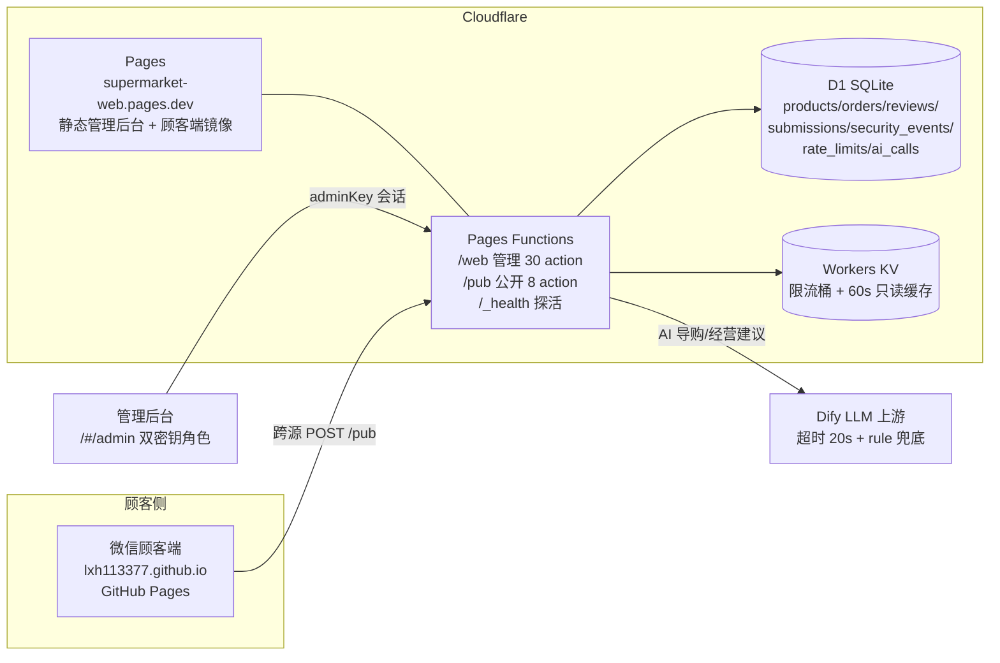

# 架构文档（ARCHITECTURE.md）

> 更新：2026-09-24 ｜ 读者：接手本项目的工程师 / AI agent。
> 部署操作红线与权威清单不在本文（见根 `AGENTS.md` 薄指针 → `chaoshi-web-deploy` skill）。
> 本文与代码不符时，以代码 + `docs/api-contract.json`（机器生成）为准，并请回改本文。

## 1. 系统总览



**双前端拓扑**：同一份 React 构建产物部署两处。Cloudflare Pages 同源承载管理后台与 API；GitHub Pages（`lxh113377.github.io`）作为微信弱网友好的顾客端，跨源调用 pages.dev 的 `/pub`（CORS 精确回显 origin）。构建期以 `VITE_CB_API_BASE` / `VITE_CB_PUBLIC_API_BASE` 烘焙端点；**两变量缺省则前端整体降级"本地演示模式"（localStorage）**——e2e 冒烟故意跑在该模式（`vite.config.e2e.js` 用空 envDir 隔离本机 `.env`）。

## 2. 前端（src/，React 19 + Vite 8 + TS strict + Tailwind）

| 层 | 位置 | 职责与关键决策 |
|---|---|---|
| 路由 | `App.tsx` + `routeLoaders.ts` | HashRouter；11 路由全 `lazy()`；hover 150ms + 空闲预取（`prefetchBus.ts` 单总线，防路由↔页面循环依赖） |
| API 层 | `api/client.ts` | `adminCall`（/web，带会话密钥）/ `publicCall`（/pub，免密钥）二分；超时 15s（AI 30s）；端点选择由**调用方语义**决定，前端不维护 action 白名单（信任边界唯一在后端 `PUBLIC_ACTIONS`） |
| 数据门面 | `db/*.ts` + `db.ts` | 云端/本地双实现统一出口；管理端**读取失败显式抛错禁静默回退本地**（防后端故障伪装成空态）；顾客 `createOrder` 失败降级本地是刻意设计（不丢单） |
| 本地存储 | `localStore.ts` | localStorage 模拟全业务（演示模式 / 下单兜底）；商品读写带浅拷贝防缓存污染 |
| 缓存 | `catalogCache.ts` 等 | 目录 60s + 写失效；`dashboardCache` 由后端 KV 承担 |
| 状态机 | `utils/orderStatus.ts` | 订单 5 态迁移表；**与 `functions/lib/actions/orders.js` 后端表逐字段 parity（`tests/orderStatus.test.ts` 锁定）**；本地模式在此强制，云端在服务端强制 |
| PWA | `public/sw.js` + manifest | 分级缓存（静态 SWR / 图片 10min）；`CACHE_VERSION` 构建期自动注入 |

## 3. 后端（functions/，Cloudflare Pages Functions，ES module，不迁 TS）

```
web.js → handleAdmin        pub.js → handlePublic（PUBLIC_ACTIONS 白名单外全拒）
functions/lib/
  backend.js   调度层：鉴权 → 角色(readonly 拦 ADMIN_WRITE_ACTIONS) → 限流 → action switch → 写失效 → 审计
  security.js  常量时间密钥比较 / KV→D1 降级限流四档 / CORS 精确回显 / 图片 scheme 白名单 / 审计(SHA-256 指纹)
  db.js        D1 JSON 列编解码 / 白名单 insert / genId（o_/p_ + 时间戳base36+随机）
  cache.js     KV 60s 只读缓存 + invalidate{PublicCatalog,Dashboard,AiAdvice}
  actions/     products / orders / reviews / submissions / stats / ai 按域拆分
  dify.js      LLM 上游 + 30s 超时 + rule-based 兜底（source=rule 永不 5xx）
```

**关键不变式**（改代码前先核对）：
1. **金额服务端重算**——`createOrder` 按 DB 现价逐项重算，客户端传来的价格一律不信任。
2. **写失效收口**——任何改 `orders/products/reviews/submissions` 的 action 必须同时进 `ADMIN_WRITE_ACTIONS`、`DASHBOARD_WRITE_ACTIONS`（如影响聚合），否则缓存/审计出现口子（2026-09-23 曾漏 8 项，verify-backend 已锁断言）。
3. **契约单源**——`docs/api-contract.json` 由 `scripts/api-contract.mjs` 从 backend.js 静态解析生成；CI `verify:contract` 防漂移，`PUBLIC_ACTIONS` 与 /pub case 集合必须完全对齐。
4. **订单状态机**——合法迁移唯一表在 orders.js `ORDER_TRANSITIONS`；status 列 TEXT 无 CHECK，扩态零迁移，但前端 `utils/orderStatus.ts` 必须同步（有 parity 测试）。

## 4. 数据层（db/）

- `schema.sql`：7 表 + 13 索引（`db/` 内迁移文件按时间序，D1 用 `wrangler d1 execute` 应用——走 `chaoshi-web-deploy` skill）。
- 数组/对象字段以 JSON 文本存（`items`/`images`/`subcategories`），读写经 `db.js` jparse/jstringify。
- 未做但已规划：**库存字段**（对标报告 C1：`stock INTEGER DEFAULT -1` + 下单扣减；需生产 D1 迁移，见 deliverables 对标报告实施路径）。

## 5. 质量门禁链（全部本地可跑，`npm run verify` 串联）

| 门禁 | 命令 | 拦截什么 |
|---|---|---|
| 密钥扫描 | `scan-secrets.mjs` | 明文密钥入库（pre-commit 也跑） |
| lint | `oxlint --max-warnings 0` | 135 文件 0 容忍 |
| 循环依赖 | `check-import-cycles.mjs` | 8 扩展名全扫描（曾因只扫 .js 静默假通过） |
| 契约漂移 | `api-contract.mjs` | action 集合/写标记/白名单三方对账 |
| 类型 | 双 tsconfig（前端 + functions） | TS 7 strict 0 错 |
| 单测 | vitest（28 文件 175 用例）+ coverage(v8) | 组件/域逻辑/前后端 parity |
| 后端契约 | `verify-backend.mjs`（node:sqlite 模拟 D1） | 66 断言：鉴权/限流/状态机/审计/写失效 |
| 体积 | `check-bundle-size.mjs` | 首屏 JS 90KB / CSS 11KB / chunk 90KB gzip 预算 |
| e2e | playwright（7 用例，演示模式） | 下单链路 + 管理端流转 |
| 部署 | CI 六步 + 双端发布 + 冒烟 + 失败回滚 + 每日探活 | 见 `.github/workflows/` |

## 6. 已知取舍与演化路线

- **不做**：顾客账号体系（单店免登录是产品决策）、微服务拆分、迁移 TS 到 functions（部署编译链成本）。
- **待做（对标报告 P2）**：库存防超卖（C1）、R2 图片直传（C2）、营销简化版（C3）、真实支付（C4，资质门槛）、D1 自动备份（C5）。
